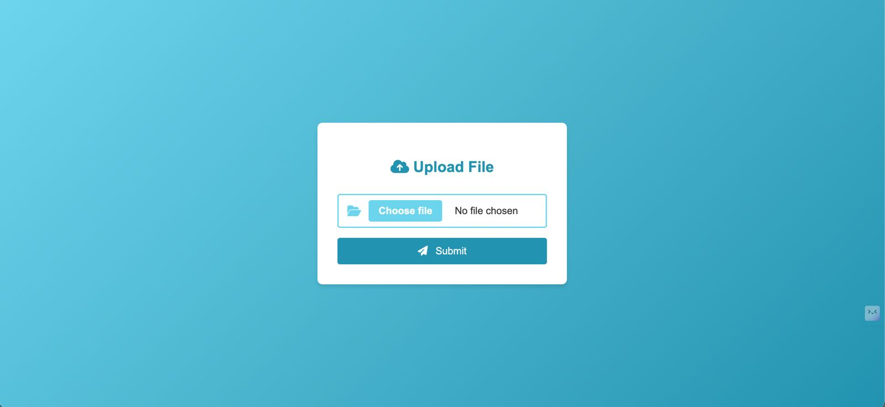
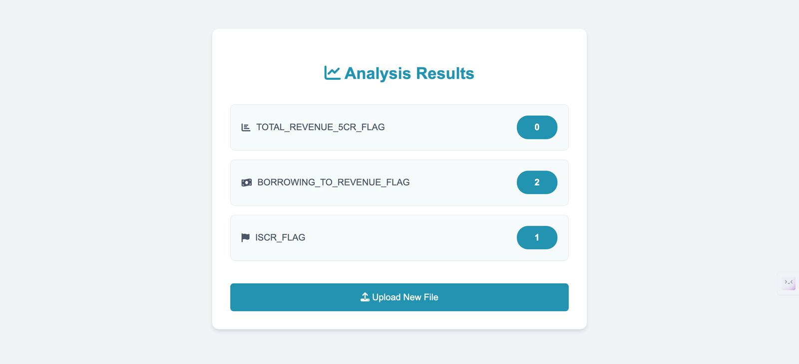

# KARBON CARD HACKATHON
## Financial Analysis Application

This project is a full-stack web application for financial analysis. It utilizes a Django backend to implement the financial analysis model and a frontend powered by the Jinja template engine, allowing users to upload data and view the analysis results.


## FEATURES OF THE APPLICATION

- Import financial data in JSON format.
- Apply predefined rules to analyze the financial data.
- Present the analysis results through a user-friendly interface.

## TECHNOLOGICAL STACK FOR THE APPLICATION

- Backend: Django (Python)
- Frontend: Django Template Engine.

### PREREQUIREMENTS FOR THE APPLICATION

- Python 
- Django

### RUNNING THE PROJECT LOCALLY 

Clone the repository:
   ```
   https://github.com/KD30062000/Karbon_Business   
   cd Karbon_Business
   ```

### BACKEND 

Navigate to the backend directory:
   ```
   cd Karbon_Business
   ```

Activate the virtualenv for the project.
   ```
   virtualenv .venv 
   source .venv/Scripts/activate
   ```

From the requirements.txt install the required packages:
   ```
   pip install -r requirements.txt
   ```

Running the application.
``` 
django-admin startproject finance_project
python manage.py startapp finance_app
```

### FRONTEND 
The frontend is handled by Django templates engine using the Jinja templates.
```
templates 
    - upload.html 
    - result.htmt
```


## API ENDPOINTS FOR THE APPLICATION

```http
http://localhost:8000/
```

## APPLICATION SCREENSHOTS 

The First page of the application where the user can upload file 

- Frontend: Django Template Engine.

### PREREQUIREMENTS FOR THE APPLICATION

- Python 
- Django

### RUNNING THE PROJECT LOCALLY 

Clone the repository:
   ```
   https://github.com/KD30062000/Karbon_Business   
   cd Karbon_Business
   ```

### BACKEND 

Navigate to the backend directory:
   ```
   cd Karbon_Business
   ```

Activate the virtualenv for the project.
   ```
   virtualenv .venv 
   source .venv/Scripts/activate
   ```

From the requirements.txt install the required packages:
   ```
   pip install -r requirements.txt
   ```

Running the application.
``` 
django-admin startproject finance_project
python manage.py startapp finance_app
```

### FRONTEND 
The frontend is handled by Django templates engine using the Jinja templates.
```
templates 
    - upload.html 
    - result.htmt
```


## API ENDPOINTS FOR THE APPLICATION

```http
http://localhost:8000/
```

## APPLICATION SCREENSHOTS 

The First page of the application where the user can upload file 

- Frontend: Django Template Engine.

### PREREQUIREMENTS FOR THE APPLICATION

- Python 
- Django

### RUNNING THE PROJECT LOCALLY 

Clone the repository:
   ```
   https://github.com/KD30062000/Karbon_Business   
   cd Karbon_Business
   ```

### BACKEND 

Navigate to the backend directory:
   ```
   cd Karbon_Business
   ```

Activate the virtualenv for the project.
   ```
   virtualenv .venv 
   source .venv/Scripts/activate
   ```

From the requirements.txt install the required packages:
   ```
   pip install -r requirements.txt
   ```

Running the application.
``` 
django-admin startproject finance_project
python manage.py startapp finance_app
```

### FRONTEND 
The frontend is handled by Django templates engine using the Jinja templates.
```
templates 
    - upload.html 
    - result.htmt
```


## API ENDPOINTS FOR THE APPLICATION

```http
http://localhost:8000/
```

## APPLICATION SCREENSHOTS 

The First page of the application where the user can upload file 


The final analysis for the data.json



